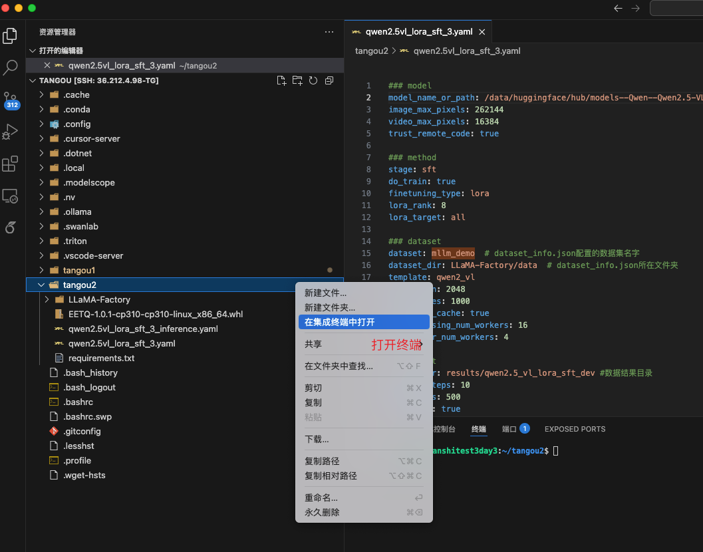

# 多模态大模型微调
# 这是公共开发环境，删除文件时，请确认清除别删错了
- 路径：/home/tangou/FTMLLM
- python环境：conda activate mllm

- Qwen2.5VL
- llamafactory: https://github.com/hiyouga/LLaMA-Factory/blob/main/README_zh.md
- git版本：https://github.com/hiyouga/LLaMA-Factory/tree/142fd7e7558fa9c169ce3d07a3fdff3eafa7b8d7
- ubuntu:22.04
- cuda:12.4.1
- python:3.10.16


```bash
source /data/tools/setproxy.sh
git clone https://github.com/floritange/FTMLLM.git
conda create -n mllm python=3.10.16
conda activate mllm
cd /home/tangou/tangou1/FTMLLM
pip install -r requirements_llamafactory.txt

# 评估：https://blog.csdn.net/H66778899/article/details/140525340

# 下载数据集：https://huggingface.co/datasets/openbmb/RLHF-V-Dataset/tree/main
# 精简版：https://huggingface.co/datasets/llamafactory/RLHF-V/tree/main
# openbmb/RLHF-V-Dataset
# llamafactory/RLHF-V
# 教程：https://developer.aliyun.com/article/1643200
# 数据集：https://huggingface.co/datasets/UCSC-VLAA/MedTrinity-25M

# 教程最新: https://github.com/datawhalechina/self-llm/blob/master/models/Qwen2-VL/04-Qwen2-VL-2B%20Lora%20%E5%BE%AE%E8%B0%83.md
# 🔥https://baaidata.csdn.net/67bd31f13b685529b7ffd73c.html
# 🔥https://blog.csdn.net/2301_80247435/article/details/143678295

# 系列教程：https://zhuanlan.zhihu.com/p/26993872051
# https://blog.csdn.net/2301_80247435/article/details/143678295

=== python
from datasets import load_dataset
# 加载数据集 huggingface token
ds = load_dataset("UCSC-VLAA/MedTrinity-25M", "25M_demo", cache_dir="/data/huggingface/hub",token="xxxx")
===


huggingface-cli login
# token: xxxx
# huggingface-cli download --resume-download <xxx> --local-dir-use-symlinks False
export HUGGINGFACE_HUB_CACHE="/data/huggingface/hub"
huggingface-cli download --resume-download --repo-type dataset llamafactory/RLHF-V --local-dir-use-symlinks False

# 教程：https://github.com/hiyouga/LLaMA-Factory/blob/main/README_zh.md
# https://github.com/hiyouga/LLaMA-Factory/tree/main/examples
# model位置：/data/huggingface/hub/models--Qwen--Qwen2.5-VL-32B-Instruct/snapshots/6bcf1c9155874e6961bcf82792681b4f4421d2f7
# /data/huggingface/hub/models--Qwen--Qwen2.5-VL-3B-Instruct/snapshots/319ccfdc6cd974fab8373cb598dfe77ad93dedd3
# rlhf位置：/data/huggingface/hub/datasets--openbmb--RLHF-V-Dataset/snapshots/1d8e9804b59e9da64ad7b1e17d505869ab9b2ad3
# rlhf精简版：/data/huggingface/hub/datasets--llamafactory--RLHF-V/snapshots/7e91ceac7cd540381751d434c8ab40ea1138ef9f
# 1.参考配置dataset_info.json文件：https://github.com/hiyouga/LLaMA-Factory/blob/main/data/README_zh.md
# 2.配置qwen2.5vl_lora_dpo.yaml文件
export HUGGINGFACE_HUB_CACHE="/data/huggingface/hub"
export NCCL_P2P_LEVEL=NVL
NCCL_P2P_LEVEL=NVL HUGGINGFACE_HUB_CACHE="/data/huggingface/hub" FORCE_TORCHRUN=1 CUDA_VISIBLE_DEVICES=4,5,6,7 llamafactory-cli train /home/tangou/tangou1/FTMLLM/configs/qwen2.5vl_lora_sft_3.yaml
NCCL_P2P_LEVEL=NVL HUGGINGFACE_HUB_CACHE="/data/huggingface/hub" FORCE_TORCHRUN=1 CUDA_VISIBLE_DEVICES=4,5,6,7 llamafactory-cli chat /home/tangou/tangou1/FTMLLM/configs/qwen2.5vl_lora_sft_3_inference.yaml
NCCL_P2P_LEVEL=NVL HUGGINGFACE_HUB_CACHE="/data/huggingface/hub" FORCE_TORCHRUN=1 CUDA_VISIBLE_DEVICES=4,5,6,7 llamafactory-cli webchat /home/tangou/tangou1/FTMLLM/configs/qwen2.5vl_lora_sft_3_inference.yaml
kill -9 1966685 1968824 1968825 1968826 1968827 1968839 1968840 1968841


####### 教程
source /data/tools/setproxy.sh
git clone https://github.com/hiyouga/LLaMA-Factory.git
cd LLaMA-Factory
git checkout 142fd7e7558fa9c169ce3d07a3fdff3eafa7b8d7
conda create -n mllm python=3.10.16
conda activate mllm
# 新建个requirements_llamafactory.txt，配置在上面
pip install -r requirements_llamafactory.txt
wget https://github.com/floritange/FTMLLM/blob/main/EETQ-1.0.1-cp310-cp310-linux_x86_64.whl
pip install EETQ-1.0.1-cp310-cp310-linux_x86_64.whl


# 教程：https://github.com/hiyouga/LLaMA-Factory/tree/main/examples
# 参考sft脚本，如：
# llamafactory-cli train examples/train_lora/qwen2vl_lora_sft.yaml
# llamafactory-cli webchat examples/inference/llama3_lora_sft.yaml
# CUDA_VISIBLE_DEVICES=0,1,2,3,4,5,6,7
export HUGGINGFACE_HUB_CACHE="/data/huggingface/hub"
# 训练
NCCL_P2P_LEVEL=NVL HUGGINGFACE_HUB_CACHE="/data/huggingface/hub" FORCE_TORCHRUN=1 CUDA_VISIBLE_DEVICES=4,5,6,7 llamafactory-cli train /home/tangou/tangou1/FTMLLM/configs/qwen2.5vl_lora_sft_3.yaml
# 推理
NCCL_P2P_LEVEL=NVL HUGGINGFACE_HUB_CACHE="/data/huggingface/hub" FORCE_TORCHRUN=1 CUDA_VISIBLE_DEVICES=4,5,6,7 llamafactory-cli webchat /home/tangou/tangou1/FTMLLM/configs/qwen2.5vl_lora_sft_3_inference.yaml

#####  两个yaml配置如下：

# qwen2.5vl_lora_sft_3.yaml
===
### model，模型在共享目录下
model_name_or_path: /data/huggingface/hub/models--Qwen--Qwen2.5-VL-3B-Instruct/snapshots/319ccfdc6cd974fab8373cb598dfe77ad93dedd3
image_max_pixels: 262144
video_max_pixels: 16384
trust_remote_code: true

### method
stage: sft
do_train: true
finetuning_type: lora
lora_rank: 8
lora_target: all

### dataset
dataset: mllm_demo
dataset_dir: /home/tangou/tangou1/FTMLLM/LLaMA-Factory/data  # dataset_info.json所在文件夹
template: qwen2_vl
cutoff_len: 2048
max_samples: 1000
overwrite_cache: true
preprocessing_num_workers: 16
dataloader_num_workers: 4

### output
output_dir: /home/tangou/tangou1/1results/qwen2.5_vl/lora/sft_dev
logging_steps: 10
save_steps: 500
plot_loss: true
overwrite_output_dir: true
save_only_model: false

### train
per_device_train_batch_size: 1
gradient_accumulation_steps: 8
learning_rate: 1.0e-4
num_train_epochs: 3.0
lr_scheduler_type: cosine
warmup_ratio: 0.1
bf16: true
ddp_timeout: 180000000
resume_from_checkpoint: null

### eval
# val_size: 0.1
# per_device_eval_batch_size: 1
# eval_strategy: steps
# eval_steps: 500

### SwanLab 配置 (这里改为自己的信息)
use_swanlab: true
swanlab_project: llamafactory
swanlab_mode: cloud
swanlab_api_key: iiuay9Y1iDp0wrrYDX4cW

# deepspeed
deepspeed: /home/tangou/tangou1/cache/ds_z3_config.json
===

# qwen2.5vl_lora_sft_3_inference.yaml
===
model_name_or_path: /data/huggingface/hub/models--Qwen--Qwen2.5-VL-3B-Instruct/snapshots/319ccfdc6cd974fab8373cb598dfe77ad93dedd3
adapter_name_or_path: /home/tangou/tangou1/1results/qwen2.5_vl/lora/sft_dev
template: qwen2_vl
infer_backend: vllm  # choices: [huggingface, vllm]
trust_remote_code: true
===

# ds_z3_config.json
===
{
  "train_batch_size": "auto",
  "train_micro_batch_size_per_gpu": "auto",
  "gradient_accumulation_steps": "auto",
  "gradient_clipping": "auto",
  "zero_allow_untested_optimizer": true,
  "fp16": {
    "enabled": "auto",
    "loss_scale": 0,
    "loss_scale_window": 1000,
    "initial_scale_power": 16,
    "hysteresis": 2,
    "min_loss_scale": 1
  },
  "bf16": {
    "enabled": "auto"
  },
  "zero_optimization": {
    "stage": 3,
    "overlap_comm": true,
    "contiguous_gradients": true,
    "sub_group_size": 1000000000.0,
    "reduce_bucket_size": "auto",
    "stage3_prefetch_bucket_size": "auto",
    "stage3_param_persistence_threshold": "auto",
    "stage3_max_live_parameters": 1000000000.0,
    "stage3_max_reuse_distance": 1000000000.0,
    "stage3_gather_16bit_weights_on_model_save": true
  }
}
===


  "rlhf_v": {
    "hf_hub_url": "llamafactory/RLHF-V",
    "ranking": true,
    "formatting": "sharegpt",
    "columns": {
      "messages": "conversations",
      "chosen": "chosen",
      "rejected": "rejected",
      "images": "images"
    }
  },

  "mllm_demo": {
    "file_name": "mllm_demo.json",
    "formatting": "sharegpt",
    "columns": {
      "messages": "messages",
      "images": "images"
    },
    "tags": {
      "role_tag": "role",
      "content_tag": "content",
      "user_tag": "user",
      "assistant_tag": "assistant"
    }
  },

```
```json
,
  "rlhf_v_custom": {
    "hf_hub_url": "llamafactory/RLHF-V",
    "ranking": true,
    "formatting": "sharegpt",
    "columns": {
      "messages": "conversations",
      "chosen": "chosen",
      "rejected": "rejected",
      "images": "images"
    }
  },
  "mllm_demo_custom": {
    "file_name": "mllm_demo.json",
    "formatting": "sharegpt",
    "columns": {
      "messages": "messages",
      "images": "images"
    }
  }
```


数据格式
```json
[
  {
   
    "messages": [
      {
   
        "content": "<image>他们是谁？",
        "role": "user"
      },
      {
   
        "content": "他们是拜仁慕尼黑的凯恩和格雷茨卡。",
        "role": "assistant"
      },
      {
   
        "content": "他们在做什么？",
        "role": "user"
      },
      {
   
        "content": "他们在足球场上庆祝。",
        "role": "assistant"
      }
    ],
    "images": [
      "mllm_demo_data/1.jpg"
    ]
  }
]
```

```bash
llamafactory-cli train \
    --stage sft \
    --do_train True \
    --model_name_or_path /data/huggingface/hub/models--Qwen--Qwen2.5-VL-3B-Instruct/snapshots/319ccfdc6cd974fab8373cb598dfe77ad93dedd3 \
    --preprocessing_num_workers 16 \
    --finetuning_type lora \
    --template qwen2_vl \
    --flash_attn auto \
    --dataset_dir data \
    --dataset mllm,mllm_demo_custom \
    --cutoff_len 2048 \
    --learning_rate 5e-05 \
    --num_train_epochs 3.0 \
    --max_samples 100000 \
    --per_device_train_batch_size 2 \
    --gradient_accumulation_steps 8 \
    --lr_scheduler_type cosine \
    --max_grad_norm 1.0 \
    --logging_steps 5 \
    --save_steps 100 \
    --warmup_steps 0 \
    --packing False \
    --report_to none \
    --output_dir saves/Qwen2.5-VL-3B-Instruct/lora/train_2025-03-31-15-32-55 \
    --bf16 True \
    --plot_loss True \
    --trust_remote_code True \
    --ddp_timeout 180000000 \
    --include_num_input_tokens_seen True \
    --optim adamw_torch \
    --lora_rank 8 \
    --lora_alpha 16 \
    --lora_dropout 0 \
    --lora_target all \
    --deepspeed cache/ds_z3_config.json
    --use_swanlab True \
    --swanlab_project llamafactory \
    --swanlab_api_key iiuay9Y1iDp0wrrYDX4cW \
    --swanlab_mode cloud
```


cp -r /home/tangou/tangou1/FTMLLM/share/* /data/3e/share/

```bash
.
├── models
│   ├── ft_models		#微调后的模型
│   └── llm_models	    #微调前基座llm
├── README.md
├── requirements.txt
└── src					#所有代码文件位置
    └── down_llm.py
```


### 微调：https://github.com/hiyouga/LLaMA-Factory/tree/main/examples
- Swanlab：https://swanlab.cn/login
- 13056500789
- tg123456
- api_key: iiuay9Y1iDp0wrrYDX4cW


```bash
export HF_ENDPOINT=https://hf-mirror.com
export USE_MODELSCOPE_HUB=1
pip install EETQ-1.0.1-cp310-cp310-linux_x86_64.whl


# 推荐可视化界面
cd /home/tangou/FTMLLM/LLaMA-Factory
conda activate mllm
llamafactory-cli webui
### ui配置见下图
运行后的配置缓存路径：/home/tangou/FTMLLM/LLaMA-Factory/saves/Qwen2.5-VL-3B-Instruct/lora/train_2025-03-12-17-06-35


# ========
## data配置路径：/home/tangou/FTMLLM/LLaMA-Factory/data。只需要把数据集放入配置data_info。https://github.com/hiyouga/LLaMA-Factory/blob/main/data/README_zh.md
## 参照
/home/tangou/FTMLLM/LLaMA-Factory/data/llamafactory/RLHF-V # huggingface上面下载
/home/tangou/FTMLLM/LLaMA-Factory/data/data_info.json
  "rlhf_v": {
    "hf_hub_url": "llamafactory/RLHF-V",
    "ranking": true,
    "formatting": "sharegpt",
    "columns": {
      "messages": "conversations",
      "chosen": "chosen",
      "rejected": "rejected",
      "images": "images"
    }


# 终端
# llamafactory-cli train /home/tangou/FTMLLM/configs/qwen2.5vl_lora_dpo.yaml
# llamafactory-cli chat /home/tangou/FTMLLM/configs/qwen2.5vl_lora_dpo.yaml
# llamafactory-cli export /home/tangou/FTMLLM/configs/qwen2.5vl_lora_dpo.yaml
```


可视化
llamafactory


swanlab


后台


webchat


# 教程详细版
vscode
vscode插件安装：chinese、remote、python、pylance、python debugger、Python Environment Manager


### 服务器连接
大家查看群文件自己的user和密码

vscode连接:


1. 复制到文件里面去
```yaml
Host 36.212.4.98
  HostName 36.212.4.98
  User tangou
```


2. 点刷新，再打开文件


3. 输入密码123456，回车


4. 进入


5. 回到第2步，再去开一个目录。这是共享模型数据的目录


### 微调预备
- 环境变量：conda、ollama
1. 打开终端


2. 命令行运行，复制命令过去回车，运行。下面截图我之前运行过了，没运行。

```bash
cat /data/tools/setenv.sh >> ~/.bashrc
source ~/.bashrc
```


检查是否运行成功
```bash
conda info --envs #查看conda环境
ollama list # 查看ollama有哪些模型
ollama run bsahane/Qwen2.5-VL-7B-Instruct:Q4_K_M_benxh # 运行ollama交互式，ctrl d 取消
```


- vpn：先不用管，知道这个就行
```bash
# http://127.0.0.1:18099
source /data/tools/setproxy.sh  #启动vpn
source /data/tools/unsetproxy.sh  #关闭vpn
```

- python环境

1. 打开终端，进入文件夹
```bash
cd /home/tangou/tangou2 #你自己的路径
```


2. copy文件到目录

```bash
cp -r /data/3e/share/* /home/tangou/tangou2/
```

copy之后


3. 创建环境并安装包

```bash
# 开vpn
source /data/tools/setproxy.sh
# tg10 换成自己的名字
conda create -n tg10 python=3.10.16
# 切换环境
conda activate tg10
```


4. pip安装包

```bash
# 如果重新打开终端，没启动。请启动下，开vpn。
source /data/tools/setproxy.sh
# 安装包，第一次跑没缓存，运行时间会很久，在下数据包
pip install -r requirements.txt
# 额外安装这个包，pip源没有
pip install EETQ-1.0.1-cp310-cp310-linux_x86_64.whl
```


### 微调，这里用llamafactory提供的数据

1. 数据解读


2. 微调加载数据，首先将自定义数据配置到dataset_info.json


3. 配置模型路径

首先回到连接data共享目录，连vscode


复制路径，我们这里微调32B


3. 配置微调的配置文件qwen2.5vl_lora_sft_3.yaml

回到原来的vscode，将上面复制的model路径放进来


4. 运行微调

打开终端



```bash
# 如果重新打开终端，没启动。请启动下，开vpn。
source /data/tools/setproxy.sh
# 切换你的python环境
conda activate tg10
# 训练
NCCL_P2P_LEVEL=NVL HUGGINGFACE_HUB_CACHE="/data/huggingface/hub" FORCE_TORCHRUN=1 CUDA_VISIBLE_DEVICES=0,1,2,3,4,5,6,7 llamafactory-cli train qwen2.5vl_lora_sft_3.yaml


# 查看运行记录，swanlog是相对路径，如果端口被占用，则--port xxx
conda activate tg10
swanlab watch swanlog --port 5092
```


本地浏览器访问：http://127.0.0.1:5092


- 实测：32B
- 训练：在per_device_train_batch_size=1的情况下，32B显存空余如下，如果调72B需要乘2，72B勉强够用。根据显存空余，可调大per_device_train_batch_size=2, 4, 6, 8不等。
- 训练：6组数据（每组2-3轮对话），一个epoch需要：50s-80s。
- 推理：差点爆显存


5. 推理
```bash
source /data/tools/setproxy.sh
conda activate tg10
# 如果端口占用，请换个端口
export GRADIO_SERVER_PORT=7860
NCCL_P2P_LEVEL=NVL HUGGINGFACE_HUB_CACHE="/data/huggingface/hub" FORCE_TORCHRUN=1 CUDA_VISIBLE_DEVICES=0,1,2,3,4,5,6,7 llamafactory-cli webchat qwen2.5vl_lora_sft_3_inference.yaml
```


本地浏览器访问：http://0.0.0.0:7860


拿刚刚训练的数据来测


下载到本地


推理（这个图片在原本的模型上就一个训练过）


6. 评估（实测：32B评估时会爆显存）

```bash
source /data/tools/setproxy.sh
conda activate tg10
NCCL_P2P_LEVEL=NVL HUGGINGFACE_HUB_CACHE="/data/huggingface/hub" FORCE_TORCHRUN=1 CUDA_VISIBLE_DEVICES=0,1,2,3,4,5,6,7 llamafactory-cli train qwen2.5vl_lora_sft_3_evaluation.yaml
```


### 额外
webui运行

```bash
source /data/tools/setproxy.sh
conda activate tg10
# 如果端口占用请换个端口
export GRADIO_SERVER_PORT=7860
llamafactory-cli webui
```


下载模型、数据集

```bash
source /data/tools/setproxy.sh
conda activate tg10
huggingface-cli login # token教程：https://blog.csdn.net/m0_52625549/article/details/134255660
----
export HUGGINGFACE_HUB_CACHE="/data/huggingface/hub"  #设置缓存路径，就是之前的共享目录
# 数据集
huggingface-cli download --resume-download --repo-type dataset llamafactory/RLHF-V --local-dir-use-symlinks False
# 模型
huggingface-cli download --resume-download Qwen/Qwen2.5-VL-7B-Instruct --local-dir-use-symlinks False
```


