---
html:
    embed_local_images: true # 这个值设置是否将image转换成base64字符串
    toc: true # 这个值设置侧边栏
---

# 教程详细版
视频版地址：
链接: https://pan.baidu.com/s/1GTNBCrZ5hBw4w2CYj2jMeA?pwd=73c8 提取码: 73c8

vscode

vscode插件安装：chinese、remote、python、pylance、python debugger、Python Environment Manager


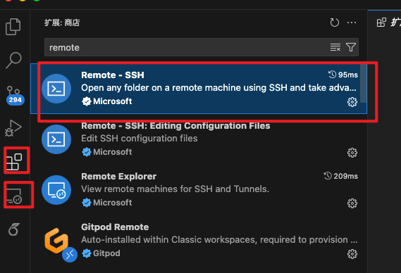


### 服务器连接
大家查看群文件自己的user和密码

vscode连接:


1. 复制到文件里面去
```yaml
Host 36.212.4.98
  HostName 36.212.4.98
  User tangou
```


2. 点刷新，再打开文件

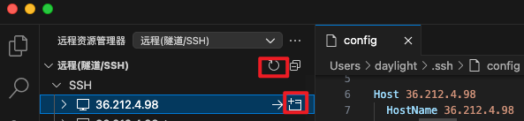

3. 输入密码123456，回车

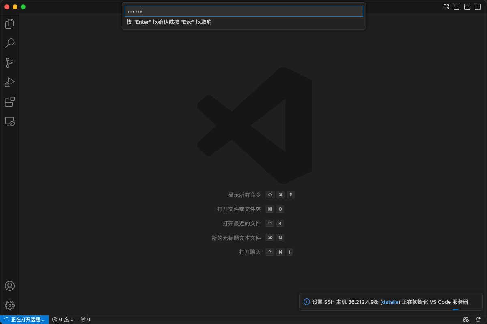

4. 进入


5. 回到第2步，再去开一个目录。这是共享模型数据的目录


### 微调预备
- 环境变量：conda、ollama
1. 打开终端


2. 命令行运行，复制命令过去回车，运行。下面截图我之前运行过了，没运行。

```bash
cat /data/tools/setenv.sh >> ~/.bashrc
source ~/.bashrc
```
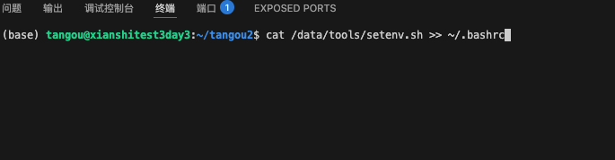

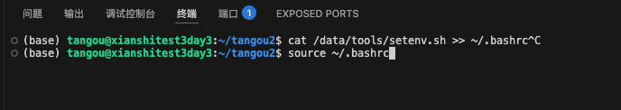

检查是否运行成功
```bash
conda info --envs #查看conda环境
ollama list # 查看ollama有哪些模型
ollama run bsahane/Qwen2.5-VL-7B-Instruct:Q4_K_M_benxh # 运行ollama交互式，ctrl d 取消
```


- vpn：先不用管，知道这个就行
```bash
# http://127.0.0.1:18099
source /data/tools/setproxy.sh  #启动vpn
source /data/tools/unsetproxy.sh  #关闭vpn
```

- python环境

1. 打开终端，进入文件夹
```bash
cd /home/tangou/tangou2 #你自己的路径
```


2. copy文件到目录

```bash
cp -r /data/3e/share/* /home/tangou/tangou2/
```

copy之后

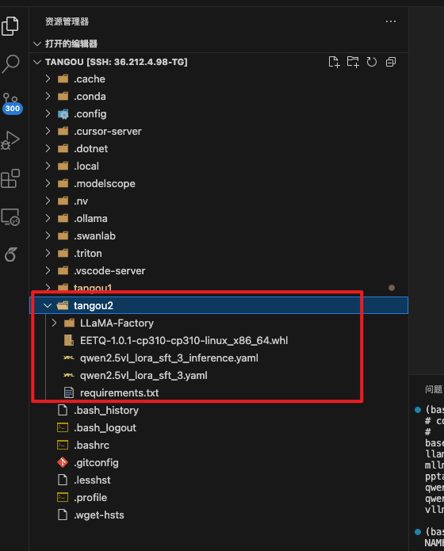

3. 创建环境并安装包

```bash
# 开vpn
source /data/tools/setproxy.sh
# tg10 换成自己的名字
conda create -n tg10 python=3.10.16
# 切换环境
conda activate tg10
```

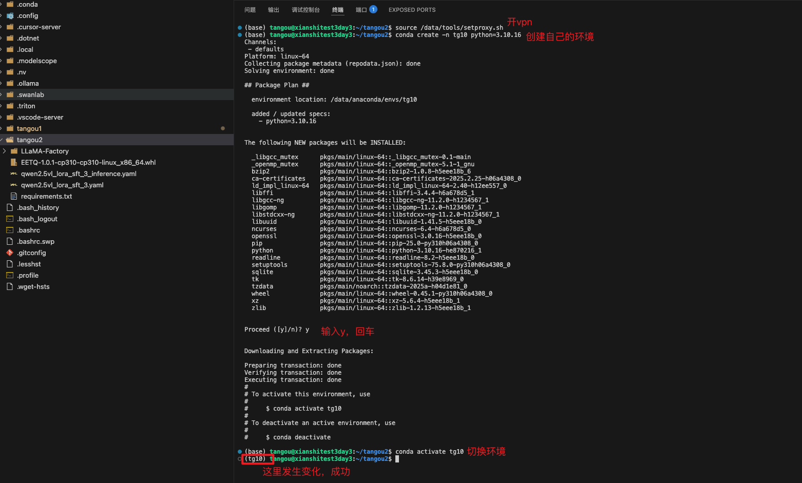

4. pip安装包

```bash
# 如果重新打开终端，没启动。请启动下，开vpn。
source /data/tools/setproxy.sh
# 安装包，第一次跑没缓存，运行时间会很久，在下数据包
pip install -r requirements.txt
# 额外安装这个包，pip源没有
pip install EETQ-1.0.1-cp310-cp310-linux_x86_64.whl
```


### 微调，这里用llamafactory提供的数据

1. 数据解读


2. 微调加载数据，首先将自定义数据配置到dataset_info.json

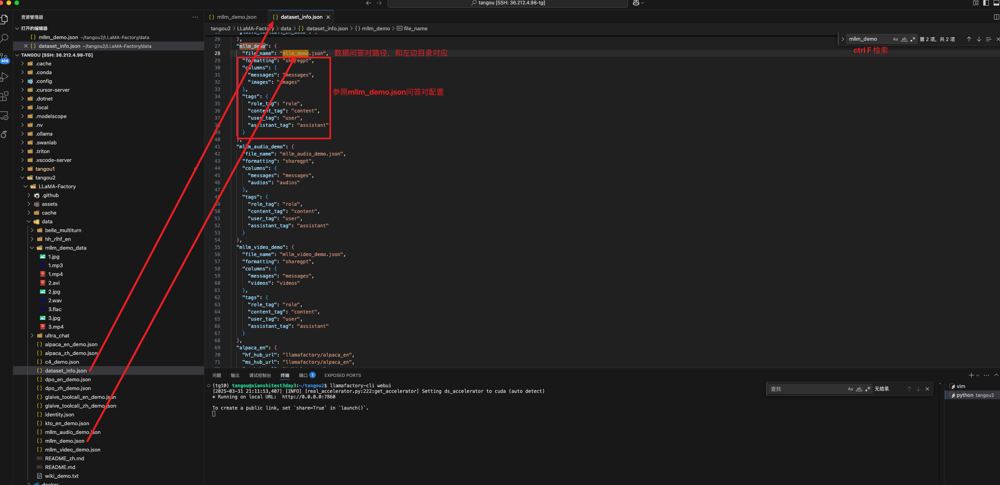

3. 配置模型路径

首先回到连接data共享目录，连vscode


复制路径，我们这里微调32B


3. 配置微调的配置文件qwen2.5vl_lora_sft_3.yaml

回到原来的vscode，将上面复制的model路径放进来


4. 运行微调

打开终端


```bash
# 如果重新打开终端，没启动。请启动下，开vpn。
source /data/tools/setproxy.sh
# 切换你的python环境
conda activate tg10
# 训练
NCCL_P2P_LEVEL=NVL HUGGINGFACE_HUB_CACHE="/data/huggingface/hub" FORCE_TORCHRUN=1 CUDA_VISIBLE_DEVICES=0,1,2,3,4,5,6,7 llamafactory-cli train qwen2.5vl_lora_sft_3.yaml


# 查看运行记录，swanlog是相对路径，如果端口被占用，则--port xxx
conda activate tg10
swanlab watch swanlog --port 5092
```


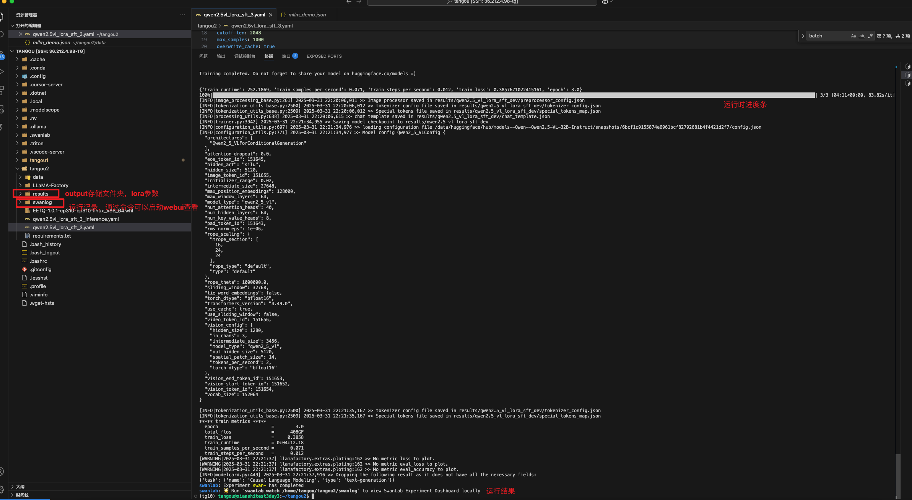

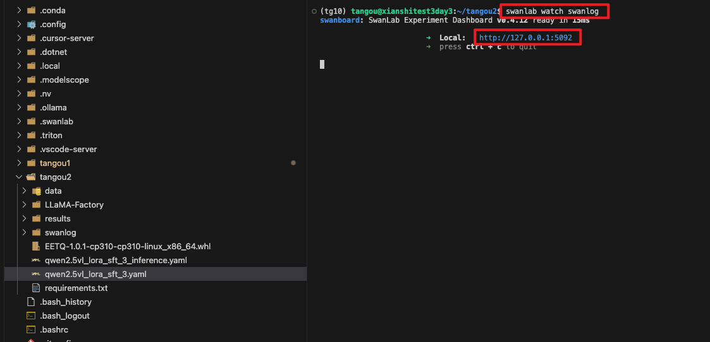

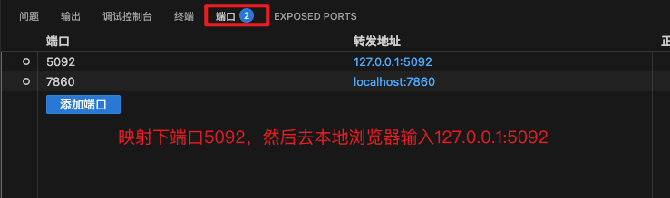

本地浏览器访问：http://127.0.0.1:5092

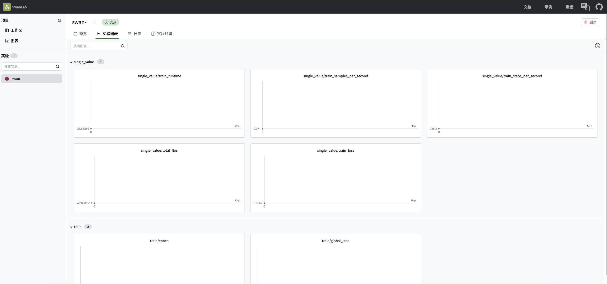


- 实测：32B
- 训练：在per_device_train_batch_size=1的情况下，32B显存空余如下，如果调72B需要乘2，72B勉强够用。根据显存空余，可调大per_device_train_batch_size=2, 4, 6, 8不等。
- 训练：6组数据（每组2-3轮对话），一个epoch需要：50s-80s。
- 推理：差点爆显存
- 评估：直接爆显存


5. 推理
```bash
source /data/tools/setproxy.sh
conda activate tg10
# 如果端口占用，请换个端口
export GRADIO_SERVER_PORT=7860
NCCL_P2P_LEVEL=NVL HUGGINGFACE_HUB_CACHE="/data/huggingface/hub" FORCE_TORCHRUN=1 CUDA_VISIBLE_DEVICES=0,1,2,3,4,5,6,7 llamafactory-cli webchat qwen2.5vl_lora_sft_3_inference.yaml
```


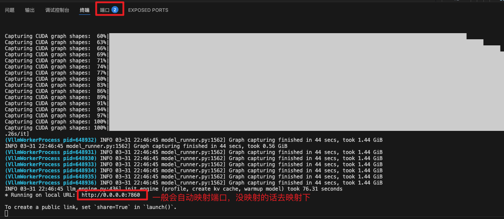

本地浏览器访问：http://0.0.0.0:7860

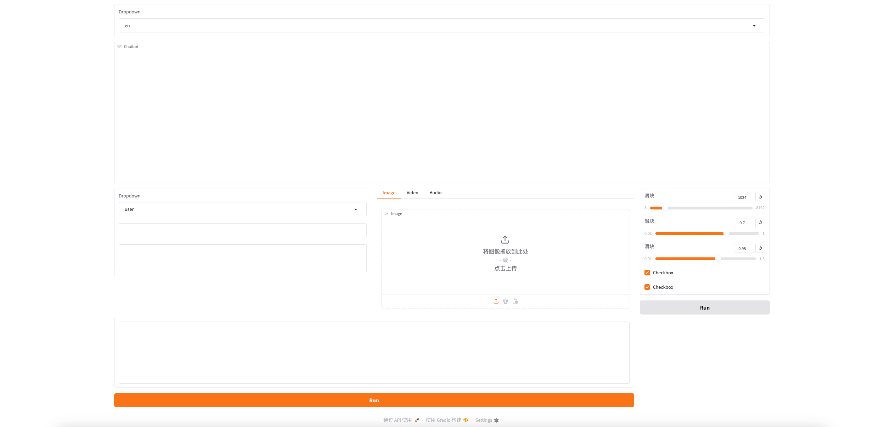

拿刚刚训练的数据来测


下载到本地


推理（这个图片在原本的模型上就一个训练过）


6. 评估（实测：32B评估时会爆显存）

```bash
source /data/tools/setproxy.sh
conda activate tg10
NCCL_P2P_LEVEL=NVL HUGGINGFACE_HUB_CACHE="/data/huggingface/hub" FORCE_TORCHRUN=1 CUDA_VISIBLE_DEVICES=0,1,2,3,4,5,6,7 llamafactory-cli train qwen2.5vl_lora_sft_3_evaluation.yaml
```


### 额外
webui运行

```bash
source /data/tools/setproxy.sh
conda activate tg10
# 如果端口占用请换个端口
export GRADIO_SERVER_PORT=7860
llamafactory-cli webui
```


下载模型、数据集

```bash
source /data/tools/setproxy.sh
conda activate tg10
huggingface-cli login # token教程：https://blog.csdn.net/m0_52625549/article/details/134255660
----
export HUGGINGFACE_HUB_CACHE="/data/huggingface/hub"  #设置缓存路径，就是之前的共享目录
# 数据集
huggingface-cli download --resume-download --repo-type dataset llamafactory/RLHF-V --local-dir-use-symlinks False
# 模型
huggingface-cli download --resume-download Qwen/Qwen2.5-VL-7B-Instruct --local-dir-use-symlinks False
```


